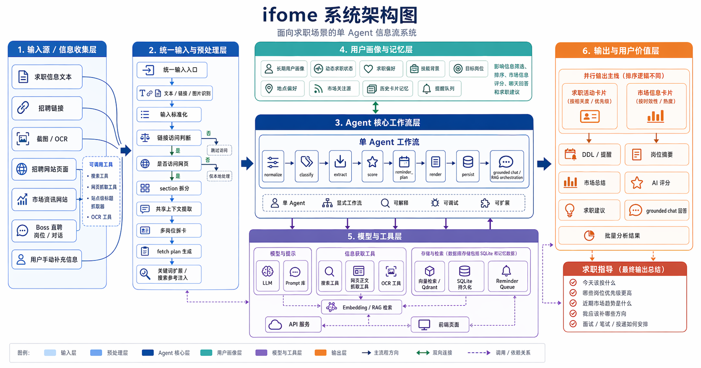
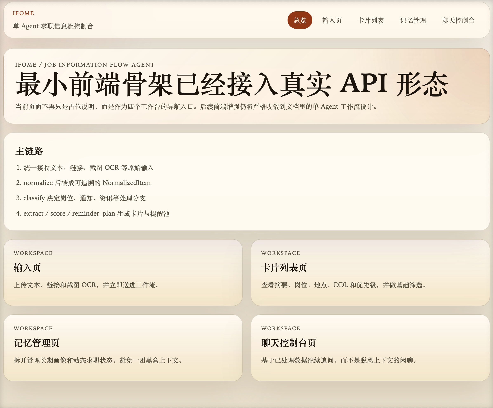

# ifome

`ifome` 是一个面向求职场景的单 Agent 信息流项目：它把招聘链接、聊天截图、文本消息，以及后续来自 Boss 直聘等连接器的岗位内容与 HR 对话，统一收敛成可解释、可调试、可扩展的信息处理系统。

这个 public 版本不是“把开发仓库原样公开”，而是一个适合展示给招聘方和其他用户的展示仓库：

- 保留核心代码和可运行能力
- 保留安装、启动、测试、接口和模块说明
- 展示当前完成度、迭代状态和下一步计划
- 明确隔离个人信息、私有配置和私人面试材料

主开发仓库继续 private，public 展示仓库只承载“可迁移、可复用、可讲清楚”的部分。

## 项目目标

- 统一接收求职文本、链接和 OCR 截图
- 显式完成 normalize / classify / extract / score / reminder_plan / render
- 为用户生成卡片、提醒、市场观察和 grounded chat
- 基于用户画像，把“信息收敛”和“求职决策支持”结合起来

## 可视化预览

### 系统架构



### 首页工作台



### 求职活动卡片


### 市场信息卡片


## 当前完成度

- 已完成统一输入：文本、链接、图片 OCR、PDF/文本文件上传、本地路径解析
- 已完成显式工作流：normalize / classify / extract / score / reminder_plan / render
- 已完成 SQLite 持久化、卡片去重和更新覆盖
- 已完成用户画像、动态求职状态和 grounded chat / RAG
- 已完成聊天控制台双模式：grounded chat + Boss / HR 回复模拟
- 已完成简历、项目说明上传后的结构化画像沉淀与源文件回看
- 已完成市场信息刷新、大卡片 / 小卡片组织、批量卡片操作
- 已完成 `pip install -e .` 与 `ifome` 一键启动
- 已完成公共同步与一键推送脚本

## 当前还在迭代中的部分

- 真正独立的服务端 scheduler
- 更强的网站级标题抓取和详情页适配器
- 更完整的 live ranking / retrieval 评测链路
- 更细致的前端产品化体验

## 技术栈

- Backend: FastAPI, Pydantic, handwritten runtime first + LangGraph-compatible workflow layer
- Frontend: Next.js, React, TypeScript
- Storage: SQLite
- Retrieval: Qdrant-compatible vector layer + app-level RAG orchestration
- Tooling: prompt library, search adapter, web page fetcher, recent-site-title adapters

## 系统结构

当前实现必须收敛到以下两份权威文档，不偏离主链路：

- `docs/job_agent_whitepaper.md`
- `docs/job_agent_engineering_doc.md`

当前补充阅读顺序建议：

- `docs/user_guide.md`
- `docs/repo_structure.md`
- `docs/readiness_gap.md`
- `docs/next_execution_plan.md`
- `docs/interview_guide.md`

## 设计原则

- 单 Agent 工作流优先，不提前引入多 Agent。
- 状态、节点、工具调用和中间结果必须显式可见。
- POC 可以借助 LangGraph，但核心抽象要预留给后续手写 Runtime。
- 实验功能必须隔离，不能污染主链路。
- 核心表和 schema 从第一天开始预留 `user_id` 与 `workspace_id`。

## 仓库结构

```text
ifome/
├─ apps/
│  ├─ api/
│  └─ web/
├─ core/
│  ├─ graph/
│  ├─ runtime/
│  ├─ schemas/
│  ├─ memory/
│  ├─ extraction/
│  ├─ ranking/
│  ├─ reminders/
│  ├─ tools/
│  ├─ chat/
│  ├─ observability/
│  └─ storage/
├─ integrations/
├─ prompts/
├─ tests/
├─ docs/
└─ data/
```

## 分层理解

- `apps/`：可以独立启动和对外交互的应用层，比如 API 服务和 Web 前端。它更像系统的“壳”，负责接请求、返回页面、暴露接口。
- `core/`：项目核心业务层，负责定义状态、业务规则、工作流节点、记忆、打分、提醒和聊天策略。它决定系统“怎么工作”。
- `core/runtime/`：运行时抽象层，负责回答“这些节点由谁按什么顺序执行”。当前默认走手写顺序 Runtime，LangGraph 只保留为兼容层和 POC 参考。

## 核心模块

- `apps/api`：统一输入、市场刷新、聊天、memory、items 等 API
- `apps/web`：输入页、卡片页、记忆页、聊天页
- `core/graph`：工作流节点与主链路编排
- `core/extraction`：标准化、规则抽取、live LLM 接入
- `core/chat`：grounded chat / RAG
- `core/storage`：SQLite 持久化
- `core/tools`：搜索、网页抓取、向量、LLM、站点级标题适配

## API 与界面说明

主要用户入口：

- `/ingest`：统一输入文本、链接、截图、PDF/文本文件和本地路径
- `/items`：查看求职活动和市场信息卡片
- `/memory`：维护长期画像、动态状态、项目画像、简历资料和市场关注源
- `/settings`：维护通用 LLM 与独立 OCR LLM 的本地运行设置
- `/chat`：基于已有卡片继续提问，或切换到 Boss / HR 回复模拟

主要 API：

- `POST /ingest/auto`
- `GET /items`
- `GET /items/{id}`
- `POST /items/batch-delete`
- `POST /market/refresh`
- `POST /chat/query`
- `POST /memory/profile`
- `POST /memory/career-state`

## 安装与一键启动

推荐先在本地创建 Python 虚拟环境，然后在项目根目录执行：

```bash
pip install -e .
```

安装完成后，直接运行下面这一条命令即可同时启动后端和前端，并自动打开浏览器：

```bash
ifome
```

默认行为：

- 后端启动在 `http://127.0.0.1:8000`
- 前端启动在 `http://127.0.0.1:3000`
- 当前命令行会同时持续输出前后端日志，其中后端日志不会被隐藏
- 如果前端依赖还没装好，会先自动执行一次 `npm install`

常用可选参数示例：

```bash
ifome --no-browser
ifome --api-port 8100 --web-port 3100
```

说明：

- 这条统一命令依赖本机已经安装 `Node.js` 和 `npm`
- 如果你是从源码仓库运行，它会优先使用当前仓库里的 `apps/web`
- 如果你是通过安装包运行，它会自动准备一份可运行的前端副本再启动

## 公共仓库同步

为了把本地项目同步到一个不包含个人数据的 GitHub 仓库，项目现在新增了：

- `public_sync_manifest.txt`：公共文件白名单
- `ifome sync-public --target <目录>`：按白名单同步公共文件
- `ifome push-public --target <目录>`：同步后自动 `git add / commit / push`

示例：

```bash
ifome sync-public --target /path/to/your/github-repo
```

这条命令会：

- 只同步 `public_sync_manifest.txt` 里列出的文件
- 自动跳过 `.env.local`、SQLite 运行数据、个人面试材料等未列出的内容
- 根据上一次同步记录删除目标目录里已经不再允许同步的旧文件

如果目标目录本身已经是绑定好远端的 Git 仓库，可以直接：

```bash
ifome push-public --target /path/to/your/github-repo
```

如果本机已经有 `~/GITHUB_TOKEN`，或者显式传入：

```bash
ifome push-public --target /path/to/your/github-repo --github-token-file ~/GITHUB_TOKEN
```

脚本会直接用 token 完成远端推送，不会把 token 写进仓库文件。

不会上传的内容示例：

- `project_extract_ifome_resume.md` 这种私人面试准备文档
- `interview_reference.md` 这种偏个人化讲述材料
- `.env.local`、本地 token 文件、测试 API 配置
- `data/runtime/*.sqlite3` 这类本地运行数据

## 测试与验证

常用验证命令：

```bash
./.venv/bin/pytest tests -q
cd apps/web && npm run build
```

public 发布链路验证：

```bash
./.venv/bin/ifome push-public --target <public-repo-dir> --project-dir . --github-token-file ~/GITHUB_TOKEN
```

## 下一步计划

- 收口 server-side scheduler
- 继续补充站点级市场抓取适配器
- 强化检索、评分和评测体系
- 继续把展示仓库整理成更完整的工程作品集形态
